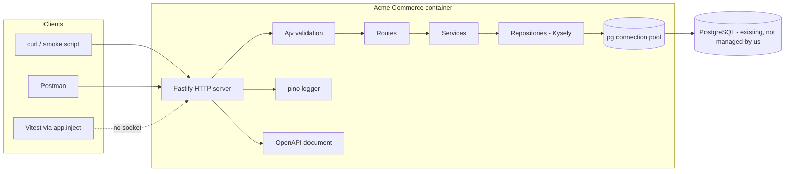
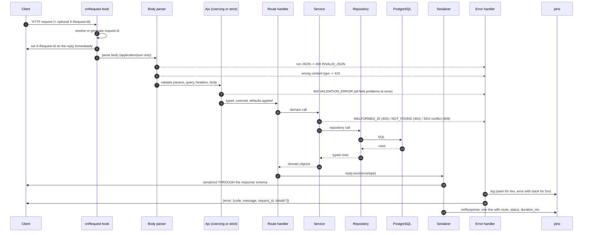
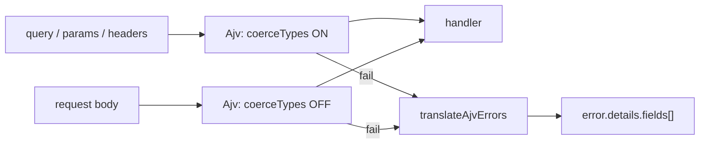
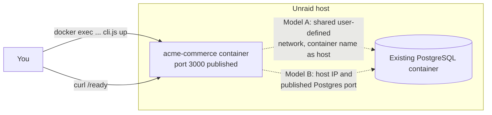

# Architecture

## Shape of the system

One process, one container, one PostgreSQL connection pool.



There is no message broker, no cache, no worker process, and no service mesh. Webhook delivery
in Milestone 4 will need background work, and it will be added then, with a decision record
explaining why it became necessary. Infrastructure introduced before there is a problem to
solve is infrastructure you cannot evaluate.

The application **connects to** a PostgreSQL instance. It never creates, configures, or manages
one, in any environment.

## Layering

Three layers per domain module, with a strict dependency direction:

```
HTTP route  ──▶  service  ──▶  repository  ──▶  PostgreSQL
(transport)      (business)     (SQL)
```

| Layer                            | Owns                                                                      | Must not know about                   |
| -------------------------------- | ------------------------------------------------------------------------- | ------------------------------------- |
| **Route** (`routes.ts`)          | Schemas, status codes, headers, envelope shaping, OpenAPI metadata        | SQL, table names                      |
| **Service** (`service.ts`)       | Business rules: SKU uniqueness, archive semantics, what "not found" means | HTTP status codes, `request`, `reply` |
| **Repository** (`repository.ts`) | Queries, filters, ordering, pagination arithmetic                         | Business rules, HTTP                  |

The value is not tidiness, it is that the three layers can be tested at three different levels
that prove genuinely different things:

- A **service** can be tested with a fake repository — no database, no server.
- A **repository** must be tested against real PostgreSQL, because it is a statement about SQL
  and a fake would agree with whatever the test expected.
- A **route** is tested end to end through `fastify.inject()`, which exercises the real router,
  hooks, validation, handler, and serializer.

A concrete example of the boundary doing work: the service raises `PRODUCT_NOT_FOUND`; it does
not know that is a 404. If Acme Commerce ever grew a gRPC or queue-driven entry point, the rule
would hold unchanged and only the mapping to a status code would be new.

## Module map

| Path                              | Responsibility                                                                |
| --------------------------------- | ----------------------------------------------------------------------------- |
| `src/index.ts`                    | Entrypoint: load config, optionally migrate, listen, handle SIGTERM/SIGINT    |
| `src/app.ts`                      | Builds the Fastify instance **without listening** — this is what tests import |
| `src/config/index.ts`             | Environment parsing and fail-fast validation                                  |
| `src/version.ts`                  | Resolves the deployed version for `/health` and the OpenAPI `info` block      |
| `src/observability/logger.ts`     | pino configuration, redaction, serializers                                    |
| `src/observability/request-id.ts` | `X-Request-Id` resolution and validation                                      |
| `src/db/index.ts`                 | Pool, Kysely instance, bigint handling                                        |
| `src/db/schema.ts`                | Hand-maintained TypeScript description of the schema                          |
| `src/db/migrator.ts`              | Migrator, migration status, schema create/drop                                |
| `src/db/cli.ts`                   | `up`, `down`, `status`, `create`, `seed`, `reset`                             |
| `src/db/guard.ts`                 | Destructive-operation safety checks                                           |
| `src/db/migrations/`              | Hand-written SQL migrations                                                   |
| `src/db/seed/`                    | Deterministic, idempotent seed data                                           |
| `src/http/errors.ts`              | Error codes, `AppError` hierarchy, PostgreSQL error translation               |
| `src/http/error-handler.ts`       | The single place an error becomes an HTTP response                            |
| `src/http/validation.ts`          | Two Ajv instances; Ajv error → `error.details.fields`                         |
| `src/http/envelope.ts`            | `{data}` / `{data, pagination}` / `{error}`                                   |
| `src/http/hooks.ts`               | Correlation header, access log                                                |
| `src/http/platform-routes.ts`     | `/health`, `/ready`, `/openapi.json`                                          |
| `src/domain/ids.ts`               | Identifier generation and format                                              |
| `src/domain/catalog/`             | Product and Variant schemas, repository, service, routes                      |
| `src/openapi/spec.ts`             | Document metadata, tags, servers, `refResolver`                               |
| `src/openapi/generate.ts`         | Writes and drift-checks `openapi/openapi.json`                                |

## Request flow



Two things in that diagram are worth dwelling on.

**The request id is set on the reply in `onRequest`**, before body parsing and before
validation. That is why a 400 from Ajv, a 415 from the content-type parser, and a 404 from the
router all carry a correlation id even though no handler ever ran. Those early failures are
precisely the ones you most need to trace.

**Responses are serialized _through_ the response schema.** A field absent from the schema is
stripped. This surprises everyone once, and it is the property that makes the contract
load-bearing rather than decorative.

## Configuration

Read once, at startup, validated completely, then immutable.

`src/config/index.ts` produces a fully-typed `Config` or throws a `ConfigError` listing **every**
problem it found. A process that boots with a missing variable and throws on the first request
that needs it has converted a five-second startup failure into a production incident. And an
operator fixing config on a remote server should not restart six times to discover six typos.

Exit code on configuration failure is **78** (`EX_CONFIG` from `sysexits.h`), which is
distinguishable from a crash.

Either `DATABASE_URL` or the discrete `PG*` variables — both together is rejected rather than
resolved by precedence rules nobody remembers.

## Database access

```mermaid
flowchart TB
    K[Kysely, .withSchema&#40;'acme'&#41;] --> POOL[pg.Pool]
    POOL -->|"options: -c search_path=acme"| PG[(PostgreSQL)]
    POOL -->|statement_timeout| PG
    POOL -->|application_name=acme-commerce| PG
    MIG[Migrator] --> K
    READY["/ready"] --> MIG
```



- **One pool per process**, created in `buildApp()` and closed by an `onClose` hook. Nothing
  else opens a connection.
- **A dedicated `acme` schema** (D-006). `search_path` is pinned on every connection _and_
  Kysely qualifies table references — belt and braces, because raw SQL in migrations relies on
  `search_path` while application queries rely on `withSchema`.
- **`statement_timeout`** is set server-side so a runaway query is cancelled rather than pinning
  a connection until the pool starves.
- **`application_name`** is set so `pg_stat_activity` can answer "which client holds this lock".
- **bigint is not parsed into a JavaScript number.** `COUNT(*)` returns bigint, and a JS number
  loses precision above 2^53. `toCount()` converts deliberately at the one place it matters,
  so the narrowing is visible in code rather than implicit.
- **The pool has an `error` listener.** Without one, an idle backend dying — for instance when
  PostgreSQL restarts underneath us — crashes the process. With one, the pool recycles the
  connection and `/ready` reports the outage.

List queries run in a **`REPEATABLE READ` transaction** so the page and the `COUNT` see one
snapshot. At the default `READ COMMITTED`, two statements each take their own snapshot and a
concurrent insert between them yields `total: 21` above 20 rows — rare, confusing, and
essentially impossible to reproduce on demand.

## Validation



Two instances, because the two inputs are genuinely different: query parameters arrive as
strings and must be coerced; request bodies arrive as parsed JSON that already has types, and
coercing there would accept `{"price_cents": "1999"}` as valid.

Both instances share `removeAdditional: false` (Fastify's default of `true` would silently
delete unknown properties instead of rejecting them) and `allErrors: true` (so four mistakes
take one round trip to fix, not four).

Ajv's raw messages are written for a schema author. `translateAjvErrors` turns them into
`{field, rule, message, allowed?}` entries naming the offending field in caller-facing terms —
`body.title`, `query.statuss`, `path.productId`.

## Authentication and authorization

**None in Milestone 1** (D-022). Every Catalog endpoint is open. Bearer tokens and internal
roles arrive in Milestone 2; partner API keys in Milestone 4.

Two things are already in place so that the first credential is not also the first credential
to be logged: `src/observability/logger.ts` redacts `authorization`, `cookie`, `x-api-key`, and
`proxy-authorization` headers, and any field named `password`, `secret`, or `token`.

Do not expose this build to an untrusted network.

## Error handling

Every failure — a validation rejection, a domain rule, a dead database, a genuine bug — leaves
the application through `src/http/error-handler.ts`. Centralising it is what makes "every error
has the same shape" a property of the system rather than a convention people follow unevenly.

```json
{
  "error": {
    "code": "SKU_ALREADY_EXISTS",
    "message": "A variant with SKU \"ACME-BAG-BLK\" already exists.",
    "request_id": "req_01a05dd29f0d47065df73ef2",
    "details": { "sku": "ACME-BAG-BLK", "conflicting_variant_id": "var_..." }
  }
}
```

Translation order: `AppError` (thrown deliberately) → JSON parse failure → Fastify's own
`FST_ERR_*` codes → PostgreSQL error codes → **opaque 500**.

Anything reaching that last branch is a bug. The client gets `code`, a generic `message`, and
`request_id` — nothing more. An exception message was written for a developer reading a stack
trace, and leaking it discloses table names, file paths, and query fragments. The full error,
with stack, goes to the log, correlated by request id.

Logging levels are asymmetric on purpose: 5xx logs at `error` with the stack, 4xx logs one line
at `warn`. A client looping on a bad request must not be able to fill the disk with stack
traces.

The error body is sent **without** a response schema. `details` has a code-dependent shape, and
a fast-json-stringify schema would strip the parts it did not know about — the one place in this
API where schema-driven serialization would actively destroy information.

## Observability

**Structured JSON logs**, one line per completed request:

```json
{
  "level": 30,
  "time": "2026-09-01T16:53:13.046Z",
  "service": "acme-commerce",
  "env": "production",
  "version": "0.1.0",
  "request_id": "req_01a05de39cd00de472b6f7f6",
  "method": "GET",
  "route": "/api/v1/products",
  "path": "/api/v1/products?limit=2",
  "status_code": 200,
  "duration_ms": 5.27,
  "msg": "request completed"
}
```

`route` is the **pattern** (`/api/v1/products/:productId`), not the concrete URL. That is what
makes "p99 latency by endpoint" answerable without parsing paths. `path` carries the concrete
URL alongside it.

Every line carries `service`, `env`, and `version`, so a shared log stream can be filtered
without the operator remembering to.

`LOG_PRETTY=true` gives coloured output for a human at a terminal; it is off in containers and
CI, where something else is reading.

Metrics and distributed tracing are deliberately absent. They will be introduced when there is
a question they answer that logs cannot.

## Health and readiness

|                                 | `/health`                                   | `/ready`                                    |
| ------------------------------- | ------------------------------------------- | ------------------------------------------- |
| Question                        | Should this process be killed and replaced? | Should traffic be sent to it?               |
| Touches PostgreSQL              | **No**                                      | Yes                                         |
| Fails when the database is down | **No**                                      | Yes, 503                                    |
| Consumed by                     | Docker `HEALTHCHECK`                        | Load balancer, deployment verification, you |

The separation matters (D-016). A liveness probe that fails during a database blip causes the
orchestrator to restart every container — turning a database outage into a database outage plus
a thundering herd of cold starts.

`/ready` runs three checks, each with its own timeout and duration, so "slow" and "unreachable"
look different:

1. **configuration** — settings were valid at startup. Cannot realistically fail, since invalid
   configuration prevents startup; reported so the output is a complete picture.
2. **database** — a live round trip. Catches a wrong host, a wrong password, a firewall, a
   stopped container.
3. **migrations** — every migration on disk is applied. New code against an old schema is a
   specific and confusing failure, and it deserves its own check.

Outside production the body also names the database being checked, password redacted. That is
usually the fastest way to discover a container is pointed at the wrong host.

## Downstream dependency simulation

Not present in Milestone 1. The Fulfillment API in Milestone 3 introduces a simulated warehouse
with reproducible failure modes (timeout, 503, malformed response, partial fulfillment). The
request id will propagate into it, so one correlation id spans the whole call tree.

## Webhook delivery

Not present in Milestone 1. Milestone 4.

## Testing strategy

| Level            | Tool                    | Database                  | Proves                                                                              | Does not prove                   |
| ---------------- | ----------------------- | ------------------------- | ----------------------------------------------------------------------------------- | -------------------------------- |
| Unit             | Vitest                  | none                      | Pure logic: id format, pagination arithmetic, Ajv translation, **the safety guard** | That anything is wired together  |
| Service          | Vitest + fake repo      | none                      | Business rules in isolation                                                         | That the SQL is right            |
| DB integration   | Vitest                  | real `acme_commerce_test` | SQL: filters, search, sort stability, constraints, triggers, cascade                | That HTTP is wired correctly     |
| HTTP integration | Vitest + `app.inject()` | real test DB              | Status codes, headers, envelopes, every documented error                            | Anything about the network       |
| Contract         | Vitest                  | none                      | Served spec = committed spec; responses validate against published schemas          | That a `description` is truthful |
| CLI smoke        | `scripts/smoke.sh`      | real dev DB               | It works over a real socket, from outside the process                               | Behaviour under load             |

`fastify.inject()` runs a full request through the real stack without opening a TCP socket. It
is fast and honest about everything except the network. `scripts/smoke.sh` covers the network,
every named failure case, and is committed as reproducible evidence rather than living in a
transcript.

**What remains unproven when all of it passes:** behaviour under real concurrency and load,
anything about TLS or proxies, whether the documented descriptions are accurate, whether the
data model suits a requirement nobody has stated yet, and whether the thing is _useful_.

## Deployment model



- **One image**, multi-stage, `node:26-alpine`, non-root, ~293 MB.
- **All configuration through environment variables.** Nothing baked in, which is what makes the
  same image runnable unchanged on a laptop and on Unraid.
- **Migrations are not run at startup** (D-020). `docker exec acme-commerce node dist/db/cli.js up`.
- **Graceful shutdown**: SIGTERM stops accepting connections, drains in-flight requests, ends
  the pool. Measured at 168 ms with an exit code of 0, versus a ~10 s SIGKILL fallback.
- **No Docker Compose**, anywhere.

Both connection models are documented in [`UNRAID_DEPLOYMENT.md`](UNRAID_DEPLOYMENT.md), and
both were exercised locally.
