# Development workflow

How a change actually gets from an idea into a running deployment, and what each step is for.

This is not a process document to be complied with. It is a description of where defects get
caught, and each step exists because catching a particular class of problem later costs more.

```mermaid
flowchart LR
    I[1. Issue] --> C[2. Clarify]
    C --> N[3. Consumers]
    N --> D[4. Contract]
    D --> B[5. Branch]
    B --> IM[6. Implement]
    IM --> T[7. Test locally]
    T --> O[8. Update OpenAPI]
    O --> DOC[9. Docs]
    DOC --> PM[10. Postman assets]
    PM --> PR[11. Pull request]
    PR --> CI[12. CI]
    CI --> RV[13. Review]
    RV --> M[14. Merge]
    M --> DP[15. Deploy]
    DP --> V[16. Verify]
    V --> OB[17. Observe]
```



---

## 1. Receive or create an issue

**What it accomplishes:** turns a conversation into something with a URL.

Write down the _observable outcome_, not the implementation. "Customers cannot filter products
by price range" is an issue. "Add a `min_price` query parameter" is a solution, and writing the
solution as the issue forecloses the discussion in step 2 before it happens.

For an API change, the issue should be able to answer: who is asking, what they cannot currently
do, and how you will know it is fixed.

## 2. Clarify requirements

**What it accomplishes:** finds the disagreement while it is still cheap.

The questions worth asking, roughly in order of how often they turn out to matter:

- What should happen in the boundary cases? (Empty result, missing input, value out of range.)
- Is this additive, or does it change existing behaviour? Those have very different costs.
- What is the expected volume? A filter over 20 products and a filter over 20 million are
  different features with the same description.
- What error should a caller get when they get it wrong, and can they act on it?

Ambiguity discovered here costs a message. Discovered in step 13, it costs a rewrite.

## 3. Identify consumers

**What it accomplishes:** tells you whether you are allowed to break anything.

For Acme Commerce, ask: does this touch `/api/v1` (internal applications) or
`/api/partner/v1` (external partners, who cannot be asked to redeploy on your schedule)? Is
there a Postman collection, a test, or a mock that encodes the current behaviour?

The consequence is concrete. A change nobody consumes can be made freely. A change with an
external consumer needs the versioning and deprecation machinery from Milestone 5, and finding
that out at step 13 means the work is wrong, not merely late.

## 4. Design or update the API contract

**What it accomplishes:** makes the interface a decision rather than a residue of the
implementation.

In this project the contract lives in `src/domain/*/schemas.ts` as TypeBox — which is JSON
Schema, which is what validates requests _and_ what appears in `/openapi.json`. So "designing
the contract" and "writing the schema" are the same act. There is no separate document to keep
in step.

Decide: route and method; path versus query parameters; request body shape; response shape;
which status codes; which error codes and what `details` each carries; what an example looks
like.

Write the description text now, while you still remember why. A `description` written after the
implementation describes what the code does; one written here describes what it is _for_.

If the change is material, put it in a comment or the issue before implementing it — that is
what makes step 13 a review rather than an archaeology exercise.

## 5. Create a branch

**What it accomplishes:** keeps `main` deployable while the change is half-finished.

```bash
git switch -c feat/product-price-filter
```

Name it after the change. `fix/`, `feat/`, `docs/`, `chore/` prefixes are conventional and
cheap.

## 6. Implement the change

**What it accomplishes:** the actual work.

Follow the layering (see [ARCHITECTURE.md](ARCHITECTURE.md)): route owns HTTP, service owns
business rules, repository owns SQL. Resisting the temptation to reach across is what keeps the
three testable at three different levels.

If the change needs a schema change:

```bash
npm run migrate:create -- add_variant_weight_grams
# edit src/db/migrations/000N_add_variant_weight_grams.ts
# ALSO edit src/db/schema.ts to match — Kysely's types are hand-maintained
npm run migrate:up
npm run migrate:status
```

Forgetting `src/db/schema.ts` produces a type error somewhere unrelated, which is annoying but
loud. That is the tradeoff accepted in [D-004](DECISIONS.md#d-004).

Write the test with the change, not after. A test written afterwards tends to assert what the
code does.

## 7. Test locally

**What it accomplishes:** finds the mistake before anyone else sees it.

```bash
npm run verify   # format:check && lint && typecheck && test && openapi:check && openapi:lint
```

Or individually while iterating:

```bash
npm run test:unit          # fast, no database
npm run test:integration   # real PostgreSQL
npm test -- catalog-read   # one file
npm run test:watch
```

Then the one that goes over a real socket:

```bash
npm run dev      # in one terminal
npm run smoke    # in another
```

Each of these proves something different, and the differences are the point:

|                    | Proves                                     | Does not prove             |
| ------------------ | ------------------------------------------ | -------------------------- |
| `test:unit`        | Logic is right                             | Anything is wired together |
| `test:integration` | SQL and HTTP wiring are right              | Anything about the network |
| `openapi:check`    | The contract matches the code              | The contract is _good_     |
| `openapi:lint`     | The contract is well-formed and documented | The descriptions are true  |
| `smoke`            | It works from outside, over TCP            | Behaviour under load       |

## 8. Update OpenAPI

**What it accomplishes:** keeps the published contract honest.

```bash
npm run openapi:generate   # regenerate openapi/openapi.json
npm run openapi:lint       # structural + governance rules
```

`npm run openapi:check` fails the build on **any** difference between the served document and
the committed snapshot. That is what makes an undocumented API change impossible to merge
accidentally.

Read the diff, do not just commit it. `git diff openapi/openapi.json` shows the contract change
as a contract change. Ask specifically: did anything get **removed**, **renamed**, **retyped**,
or **narrowed**? Those are breaking for existing consumers even though the check treats every
difference identically.

## 9. Update documentation

**What it accomplishes:** stops the docs from becoming actively misleading, which is worse than
having none.

The specific things that go stale:

- New endpoint → the README endpoint table.
- New environment variable → `.env.example` **and** `docs/UNRAID_DEPLOYMENT.md` §4.
- New error code → the README error table.
- A choice you had to think about → `docs/DECISIONS.md`. If you argued with yourself for ten
  minutes, that argument is worth four sentences.
- A new concept → `LEARNING_GUIDE.md`.

## 10. Update Postman assets

**What it accomplishes:** keeps the collection a usable tool rather than an archive.

From Checkpoint 1 onward there is a collection in `postman/`. When you add an endpoint, add the
request; when a response shape changes, update the tests that assert on it.

Re-importing the OpenAPI document into Postman is a useful cross-check: it shows you what a
_new_ consumer would see, which is not what you see, because you know what you meant.

Strip secrets before committing an environment export. `LEARNING_GUIDE.md` §7 explains the
local-versus-shared value distinction, and why `git rm` afterwards does not help.

## 11. Open a pull request

**What it accomplishes:** creates a place for the change to be discussed as a whole.

Describe what changed and **why**, link the issue, and state explicitly whether the change is
additive or breaking. If it is breaking, say what a consumer has to do.

A PR against yourself is not theatre. It gives you a diff of everything at once, which is the
view in which "wait, why did that response field disappear?" is actually visible.

## 12. Run CI

**What it accomplishes:** proves the change works somewhere that is not your laptop.

The workflow arrives in Milestone 5. It will run: dependency install, format check, lint,
typecheck, unit tests, integration tests against a temporary PostgreSQL **service container**
(not Docker Compose), migrations from empty, OpenAPI validation and drift check, application
startup verification, and a container build.

What CI proves that local testing does not: that the change works on a machine with no
`.env`, no cached `node_modules`, no already-migrated database, and no state left over from
your last three experiments. Most "works on my machine" failures are one of those four.

What it still does not prove: that the feature is correct, that the descriptions are accurate,
or that it behaves under load.

## 13. Review the change

**What it accomplishes:** a second reading, which catches a different category of problem than
any test.

What to look for, ordered by how often it is the actual problem:

- Does the contract change break an existing consumer? Check `git diff openapi/openapi.json`
  first, before the code.
- Is the error a caller can act on? Does it name the field?
- Does the test assert the behaviour, or does it assert the implementation?
- Is the layering intact, or has SQL leaked into a route?
- Is there a decision here that will be a mystery in six months?

## 14. Merge

**What it accomplishes:** makes it real.

Squash-merge keeps `main`'s history one-commit-per-change, which makes `git log` a changelog and
`git bisect` useful. Delete the branch.

## 15. Deploy

**What it accomplishes:** the change reaches something someone uses.

Build and tag with a **real version**, not `latest` — `GET /health` reports `version`, which is
only useful if the tag means something. Then follow
[UNRAID_DEPLOYMENT.md](UNRAID_DEPLOYMENT.md) §9.

Migrations are a separate, explicit step. If the release contains a migration, order matters:
safest is to migrate first, which requires the migration to be backward compatible with the code
currently running. If it is not (a dropped or renamed column), you need a two-release
expand-then-contract sequence — the subject of the Milestone 5 breaking-change exercise, and a
genuinely hard problem rather than a checklist item.

## 16. Verify after deployment

**What it accomplishes:** distinguishes "deployed" from "working", which are different.

```bash
curl -s http://REPLACE_UNRAID_HOST:3000/health   # check `version` is the one you deployed
curl -s http://REPLACE_UNRAID_HOST:3000/ready    # 200, all three checks ok
curl -s 'http://REPLACE_UNRAID_HOST:3000/api/v1/products?limit=1'
# then the specific thing you changed
```

Reading `version` from `/health` is the step people skip, and it is the one that catches "the
image did not actually update".

Once your Postman collection exists, running the folder against the Unraid environment is the
fastest post-deployment check available — the same requests, a different environment, which is
exactly what environments are for.

## 17. Observe behaviour

**What it accomplishes:** notices the problems that only appear under real use.

```bash
docker logs --tail 100 acme-commerce

# Every 5xx:
docker logs acme-commerce 2>&1 | grep '"status_code":5'

# One request end to end, by correlation id:
docker logs acme-commerce 2>&1 | grep 'req_01a05de39cd00de472b6f7f6'

# Slowest requests:
docker logs acme-commerce 2>&1 | grep 'request completed' \
  | python3 -c "
import json,sys
rows=[json.loads(l) for l in sys.stdin if l.strip().startswith('{')]
for r in sorted(rows,key=lambda r:-r.get('duration_ms',0))[:10]:
    print(f\"{r['duration_ms']:8.2f}ms {r['status_code']} {r['method']} {r.get('route')}\")"
```

The `request_id` is what makes this work. A response you saw in Postman and a log line on the
server are connected by that one string, and without it you are searching by timestamp and
hoping.

---

## Command reference

```bash
# Environment
./scripts/dev-postgres.sh              # create local dev PostgreSQL (dev only, never deployment)
./scripts/dev-postgres.sh --psql       # interactive psql as the app role
./scripts/dev-postgres.sh --down       # remove it

# Database
npm run migrate:status                 # read-only; exits 2 if pending
npm run migrate:up
npm run migrate:down                   # one migration
npm run migrate:create -- some_name
npm run db:seed
npm run db:reset -- --i-know-this-deletes-data

# Run
npm run dev                            # tsx watch
npm run build && npm start             # compiled

# Verify
npm run verify                         # everything below, in order
npm run format:check
npm run lint
npm run typecheck
npm test
npm run test:unit
npm run test:integration
npm run openapi:generate
npm run openapi:check                  # fails on contract drift
npm run openapi:lint
npm run smoke                          # needs a running server

# Container
docker build -t acme-commerce:0.1.0 .
docker exec acme-commerce node dist/db/cli.js status
```
