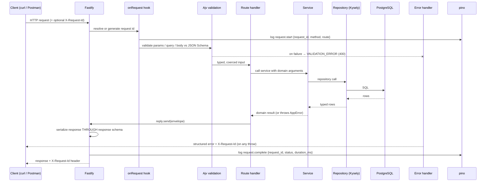

# Milestone 1A Plan — Foundation and Catalog API

Status: **planned → implemented** (see `docs/BUILD_VERIFICATION.md` for what was actually verified)
Date: 2026-09-01

This document is written **before** the implementation code, on purpose. In a real API
organisation this is the artifact you circulate for review before anyone writes a route
handler. It is the thing a reviewer disagrees with cheaply, instead of disagreeing with
2,000 lines of code expensively.

---

## 1. Selected technology stack

| Concern             | Selection                                  | Version target                                                        |
| ------------------- | ------------------------------------------ | --------------------------------------------------------------------- |
| Language            | TypeScript (strict)                        | 5.x                                                                   |
| Runtime             | Node.js                                    | **26** (pinned in `package.json` engines, `Dockerfile`, and later CI) |
| Web framework       | Fastify                                    | 5.x                                                                   |
| Schema / validation | TypeBox (JSON Schema) + Ajv (via Fastify)  | latest                                                                |
| OpenAPI emission    | `@fastify/swagger` + `@fastify/swagger-ui` | latest                                                                |
| Database driver     | `pg` (node-postgres)                       | 8.x                                                                   |
| Query layer         | Kysely (typed SQL query builder)           | latest                                                                |
| Migrations          | Kysely migrator + a thin project-owned CLI | —                                                                     |
| Tests               | Vitest + `fastify.inject()`                | latest                                                                |
| Logging             | pino (Fastify's built-in logger)           | latest                                                                |
| Lint / format       | ESLint 9 (flat config) + Prettier          | latest                                                                |
| Spec validation     | `@redocly/cli lint`                        | latest                                                                |

### 1.1 Why this stack

**TypeScript/Node, not Python or Go.**
The decisive reason is not performance, it is _language cohesion with the learning goal_.
You will spend this project writing Postman pre-request scripts and `pm.test()` assertions,
which are JavaScript. Newman and the Postman CLI are Node programs. Choosing TypeScript
means the same language, the same mental model of async, and the same JSON semantics span
the API implementation, the automated tests, and the Postman assets you author by hand.
Nothing is lost in translation between the two halves of this project.

**Fastify, not Express and not NestJS.**
Fastify's defining feature for this project is that **JSON Schema is a first-class part of
a route definition**. A route declares schemas for its params, querystring, body, and each
response status. Fastify then uses those same schemas for three separate things:

1. runtime request validation (rejecting bad input before your handler runs),
2. response serialization (the response is serialized _through_ the schema), and
3. the generated OpenAPI document.

That is not a convenience — it is the central teaching artifact of this project. "The
contract" stops being a document that describes the code and becomes the thing the code is
literally made of. Express would require three separate, independently-rotting copies of
that information. NestJS would supply the same benefit buried under decorators and a
dependency-injection container, which costs you the ability to read the request path
top-to-bottom.

Consequence worth knowing early: because responses are serialized through the response
schema, **a field absent from the schema is stripped from the response body**. This will
bite at least once. It is also the cleanest possible demonstration of why a contract is
load-bearing, and it is why the contract-drift exercise in Milestone 5 works at all.

**Kysely, not Prisma and not raw `pg` strings.**
Kysely is a typed query builder whose method chain reads like the SQL it emits. You can see
the query. Prisma introduces a proprietary schema language, a code-generation step, and a
query engine binary — three layers between you and the database, in a project whose stated
goal is that you understand the complete system. Raw SQL strings via `pg` would be maximally
transparent but give up compile-time knowledge of table and column names, which is the one
place TypeScript earns its keep in data access.

**Kysely's migrator with a project-owned CLI, not `node-pg-migrate` or Drizzle Kit.**
Migrations will be hand-written TypeScript files containing explicit SQL. No schema-diffing.
Drizzle Kit and Prisma Migrate both generate migrations by diffing a declared schema against
the database; that is efficient and it is also exactly the wrong thing for learning, because
the generated DDL is something you review rather than something you decide. The CLI wrapper
is ~120 lines and gives `up`, `down`, `status`, `create`, and a guarded `reset`. Its
`status` function does double duty as the migration check behind `GET /ready`.

**TypeBox, not Zod.**
Zod is the more popular validation library and has a nicer API, but Zod's native output is
_not_ JSON Schema — converting it is a lossy third-party step. TypeBox **is** JSON Schema
with TypeScript types layered on top. Since JSON Schema is what Fastify validates with and
what OpenAPI is made of, TypeBox removes a translation layer rather than adding one.

Full decision records, including alternatives and whether each choice is expected to last,
live in `docs/DECISIONS.md`.

---

## 2. Application architecture

A single deployable process. One container, one port, one PostgreSQL connection pool.

There is no message broker, no cache, no separate worker, and no service mesh in Milestone 1.
Webhook delivery in Milestone 4 will need background work, and that will be added _then_,
with its own decision record explaining why it became necessary. Infrastructure introduced
before there is a problem to solve is infrastructure you cannot evaluate.

### 2.1 Layering

Three layers per domain module, with a strict dependency direction:

```
HTTP route  ──▶  service  ──▶  repository  ──▶  PostgreSQL
(transport)      (business)    (SQL)
```

- **Route** owns HTTP: schemas, status codes, headers, envelope shaping. Knows nothing about SQL.
- **Service** owns business rules: SKU uniqueness, archive semantics, what "not found" means.
  Throws typed domain errors. Knows nothing about HTTP status codes or `req`/`reply`.
- **Repository** owns SQL: queries, filters, ordering, pagination arithmetic. Knows nothing
  about business rules.

The value of the split for this project is testability at different levels: services can be
unit-tested against a fake repository with no database, repositories can be integration-tested
against real PostgreSQL, and routes can be tested end-to-end through `fastify.inject()`.
Those three test types prove genuinely different things — a distinction the Learning Guide
returns to.

### 2.2 Request flow



### 2.3 Module map

| Path                  | Responsibility                                                            |
| --------------------- | ------------------------------------------------------------------------- |
| `src/index.ts`        | Entrypoint: load config, build app, listen, handle SIGTERM/SIGINT         |
| `src/app.ts`          | Builds the Fastify instance without listening (this is what tests import) |
| `src/config/`         | Environment parsing and **fail-fast** validation                          |
| `src/observability/`  | Logger construction, request-id generation and propagation                |
| `src/db/`             | Pool, Kysely instance, DB types, migrator, migration CLI, test-DB guard   |
| `src/db/migrations/`  | Hand-written SQL migrations                                               |
| `src/db/seed/`        | Deterministic, idempotent seed data                                       |
| `src/http/`           | Error model, error handler, response envelope, platform routes            |
| `src/domain/catalog/` | Product and Variant schemas, repository, service, routes                  |
| `src/openapi/`        | Spec metadata and the generator that writes the committed snapshot        |

---

## 3. PostgreSQL connection model

### 3.1 Configuration

The application never contains credentials. It reads them at runtime. Both a single URL and
discrete variables are supported, because the two deployment models in front of us favour
different styles:

- `DATABASE_URL` — one connection string. Preferred on Unraid, where it is a single field to paste.
- `PGHOST` / `PGPORT` / `PGDATABASE` / `PGUSER` / `PGPASSWORD` — discrete variables. Preferred
  in CI and in local shells where you want to override one piece.

Resolution order: if `DATABASE_URL` is set it wins, and the discrete variables are ignored.
Mixing them silently is a configuration bug the config layer refuses at startup rather than
resolving in a surprising direction.

Additional runtime knobs: `DB_SSL` (`disable` | `require` | `no-verify`), `DB_POOL_MAX`,
`DB_POOL_IDLE_TIMEOUT_MS`, `DB_CONNECT_TIMEOUT_MS`, `DB_STATEMENT_TIMEOUT_MS`.

### 3.2 Dedicated `acme` schema — a safety decision

**All application tables live in a PostgreSQL schema named `acme`, not in `public`.**

This is a deliberate response to the constraint that the application must not touch unrelated
databases or schemas. It buys three properties:

1. The application can share a PostgreSQL _database_ with something else and still be isolated.
2. The destructive development reset becomes provably narrow: `DROP SCHEMA acme CASCADE`
   cannot reach anything that is not ours. Compare with truncating a list of table names in
   `public`, where the safety of the operation depends on the list being correct and current.
3. Required privileges shrink. The application role owns its schema and needs no rights
   anywhere else — no superuser, no `public` schema grants.

The connection pool sets `search_path` to `acme` on every new connection. The migration
tracking table also lives in `acme`.

### 3.3 Privileges

The application role is **not** a superuser. It owns the database, which under PostgreSQL 15+
makes it the effective owner of that database's schemas via `pg_database_owner`. Exact SQL
with credential placeholders is in `docs/POSTGRES_SETUP.md`.

### 3.4 Local development database for this milestone

Verified against PostgreSQL **17.11** in a disposable container on the development Mac,
published on host port **55432**, with two databases:

- `acme_commerce_dev` — development
- `acme_commerce_test` — automated integration tests

That container is a _local development convenience only_. It is created by
`scripts/dev-postgres.sh`, it is not referenced by the Dockerfile, and it has no role in the
Unraid deployment path. No Docker Compose is used anywhere. Nothing on the Unraid server is
created or managed by this project.

### 3.5 Migrations at startup

`MIGRATE_ON_STARTUP` defaults to **`false`**. Migrations are an explicit, operator-run step.
Automatic migration on boot is convenient and is also how two container replicas race each
other into a corrupted schema. The flag exists, it is documented, and it is off.

---

## 4. Test database safety

`src/db/guard.ts` exports `assertSafeTestDatabase()`. Destructive tooling — the integration
test bootstrap and `db:reset` — calls it first and refuses to proceed if **any** of these hold:

1. `APP_ENV` or `NODE_ENV` is `production`.
2. `TEST_DATABASE_URL` (or the discrete test variables) is missing.
3. The **resolved target** of the test database equals the resolved target of the application
   database. Resolved target means the normalised `(host, port, database)` triple —
   `localhost`, `127.0.0.1`, and `::1` collapse to one value, and an omitted port becomes 5432. Comparing raw connection strings would let `localhost` versus `127.0.0.1` defeat the
   check, which is precisely the accident the check exists to prevent.
4. The database name does not look like a test database (must match `_test$`, `^test_`, or `_test_`).

`db:reset` additionally requires an explicit destructive-intent signal — the flag
`--i-know-this-deletes-data` or `CONFIRM_DESTRUCTIVE=yes`. There is no interactive prompt,
because a prompt is unavailable in CI and a prompt that can be bypassed is not a safeguard.

The guard is itself unit-tested, including its normalisation logic. A safety mechanism that is
never exercised is a comment.

---

## 5. Proposed entities

### 5.1 Identifiers

Prefixed, time-sortable, lowercase-hex identifiers:

```
prod_18f3a9c4e21b7d05f6a3b8c1
var_18f3a9c4e2f10394ab77c2de
```

Format: `<prefix>_` followed by 24 hex characters — 12 hex of millisecond timestamp, 12 hex of
randomness. Regex: `^prod_[0-9a-f]{24}$`.

Chosen over bare UUIDv4 for two reasons that matter here. First, the prefix makes a
**malformed identifier** syntactically distinguishable from a **valid identifier that does not
exist**, which lets the API teach the difference between `400 MALFORMED_ID` and `404 NOT_FOUND`
— a distinction most APIs blur and most API consumers are confused by. Second, an ID visible
in a log line tells you what kind of thing it is without a lookup. Tradeoff: they are not a
standard format, so a client library expecting UUIDs will not recognise them. Recorded in
`docs/DECISIONS.md`.

### 5.2 `acme.products`

| Column         | Type                   | Notes                                                   |
| -------------- | ---------------------- | ------------------------------------------------------- |
| `id`           | `text` PK              | `prod_` + 24 hex                                        |
| `title`        | `text` NOT NULL        | 1–200 chars                                             |
| `description`  | `text` NULL            | ≤ 5000 chars                                            |
| `status`       | `text` NOT NULL        | CHECK in (`draft`,`active`,`archived`), default `draft` |
| `vendor`       | `text` NULL            | ≤ 100 chars                                             |
| `product_type` | `text` NULL            | ≤ 100 chars                                             |
| `tags`         | `text[]` NOT NULL      | default `{}`, each tag ≤ 50 chars                       |
| `created_at`   | `timestamptz` NOT NULL | default `now()`                                         |
| `updated_at`   | `timestamptz` NOT NULL | maintained by trigger                                   |
| `archived_at`  | `timestamptz` NULL     | set when archived                                       |

Indexes: `status`, `lower(vendor)`, `product_type`, GIN on `tags`, `(created_at DESC, id DESC)`.

### 5.3 `acme.variants`

| Column                                      | Type               | Notes                                            |
| ------------------------------------------- | ------------------ | ------------------------------------------------ |
| `id`                                        | `text` PK          | `var_` + 24 hex                                  |
| `product_id`                                | `text` NOT NULL    | FK → `products(id)` ON DELETE CASCADE            |
| `sku`                                       | `text` NOT NULL    | **UNIQUE across the whole table**, 1–64 chars    |
| `title`                                     | `text` NOT NULL    | e.g. "Black / Medium"                            |
| `price_cents`                               | `integer` NOT NULL | CHECK ≥ 0                                        |
| `compare_at_price_cents`                    | `integer` NULL     | CHECK ≥ 0                                        |
| `currency`                                  | `text` NOT NULL    | ISO-4217, default `CAD`, CHECK `^[A-Z]{3}$`      |
| `barcode`                                   | `text` NULL        | ≤ 64 chars                                       |
| `inventory_item_id`                         | `text` NULL        | forward reference for Milestone 2                |
| `status`                                    | `text` NOT NULL    | CHECK in (`active`,`archived`), default `active` |
| `position`                                  | `integer` NOT NULL | ordering within a product, default 1             |
| `created_at` / `updated_at` / `archived_at` | `timestamptz`      | as above                                         |

**Money is stored and exposed as integer minor units** (`price_cents: 1999`), never as a float
and never as a decimal string. Floats cannot represent `0.10` exactly and money arithmetic in
floats is a genuine, common, production-grade bug. Shopify exposes `price: "19.99"` as a string;
Stripe exposes `unit_amount: 1999`. We follow Stripe. Tradeoff: `1999` is less immediately
readable to a human reading a response body, and every client must know the scale. Recorded.

`inventory_item_id` is deliberately present but unused in Milestone 1. It is the seam the
Inventory API attaches to in Milestone 2, and leaving the seam visible is more honest than
pretending the catalog exists in isolation.

---

## 6. Route design and Catalog behaviour

Versioned base path `/api/v1`. Platform endpoints are deliberately **unversioned** — they
describe the process, not the product API, and a probe should not have to track API versions.

| Method | Path                                    | Success   | Notes                                                    |
| ------ | --------------------------------------- | --------- | -------------------------------------------------------- |
| GET    | `/health`                               | 200       | Liveness. Never touches the database.                    |
| GET    | `/ready`                                | 200 / 503 | Readiness: config + DB connectivity + migration currency |
| GET    | `/openapi.json`                         | 200       | Live generated OpenAPI 3.1 document                      |
| GET    | `/docs`                                 | 200       | Swagger UI                                               |
| POST   | `/api/v1/products`                      | 201       | `Location` header set                                    |
| GET    | `/api/v1/products`                      | 200       | list/filter/search/sort/paginate                         |
| GET    | `/api/v1/products/{productId}`          | 200       |                                                          |
| PATCH  | `/api/v1/products/{productId}`          | 200       | partial update; empty body → 400                         |
| DELETE | `/api/v1/products/{productId}`          | 200       | **archives**; returns the archived resource              |
| POST   | `/api/v1/products/{productId}/variants` | 201       |                                                          |
| GET    | `/api/v1/products/{productId}/variants` | 200       | ordered by `position`, then `id`                         |
| GET    | `/api/v1/variants/{variantId}`          | 200       |                                                          |
| PATCH  | `/api/v1/variants/{variantId}`          | 200       |                                                          |
| DELETE | `/api/v1/variants/{variantId}`          | 200       | archives                                                 |

`GET /api/v1/products/{id}/variants` is an unpaginated sub-collection. A product has tens of
variants, not thousands, and the response is bounded by a documented hard cap of 250.
Documented rather than assumed.

### 6.1 DELETE means archive

`DELETE` performs a **soft archive**: it sets `status = 'archived'` and `archived_at`, and
returns `200` with the resulting resource rather than `204`.

- Returning the resource lets you _see_ the state transition, which `204 No Content` hides.
- Ecommerce catalog data is referenced by historical orders. Hard-deleting a variant that a
  2024 order references destroys that order's meaning. Archiving is what real catalogs do.
- The operation is **idempotent**: archiving an already-archived product returns `200` again,
  not `409`. Repeating a delete is not an error.

Hard deletion is not exposed. A `DELETE` that returns `200` with a body will surprise someone
— it is documented in the OpenAPI description of the operation and in the README.

### 6.2 Pagination

Offset-based. `page` (integer ≥ 1, default `1`), `limit` (integer 1–100, default `25`).

```json
{ "data": [], "pagination": { "page": 1, "limit": 25, "total": 0, "total_pages": 0 } }
```

- `total` is a real `COUNT(*)` over the filtered set, in the same transaction as the page query.
- Empty result set → **`200` with `"data": []`**, not `404`. An empty collection is a
  successful answer to a well-formed question. `total_pages` is `0` when `total` is `0`.
- A page beyond the end → `200` with `"data": []`. Not an error.
- `page=0`, `limit=0`, `limit=101`, `page=abc` → `400 VALIDATION_ERROR`.

Cursor pagination was considered and deferred. Offset pagination has a real, teachable defect:
if a row is inserted while you are paging, an item can be skipped or repeated across pages.
Cursor pagination fixes that and costs the ability to jump to page 7. Offset is chosen because
`page`/`limit` is what the target endpoint map specifies and because its defect is a better
lesson when you meet it than a fix you never understood the need for. Revisit if a collection
grows past ~100k rows.

### 6.3 Filtering

| Parameter      | Behaviour                                                                       |
| -------------- | ------------------------------------------------------------------------------- |
| `status`       | Exact enum match: `draft` \| `active` \| `archived`. Invalid value → 400        |
| `vendor`       | Case-insensitive **exact** match (`lower(vendor) = lower($1)`), not a prefix    |
| `product_type` | Case-insensitive exact match                                                    |
| `tag`          | Array containment: the product must carry this tag. Single value in Milestone 1 |

Filters combine with **AND**. There is no `OR` and no filter-expression language.

**`GET /api/v1/products` applies no implicit status filter.** Archived products appear in the
default listing. Most real catalog APIs hide archived records by default; this one does not,
and that is a deliberate teaching choice: it makes `DELETE` observable as a _state change_
rather than as a disappearance, and it means the response to `GET /products` is fully
determined by the query string with no hidden term. Explicitly documented so it cannot be
mistaken for an oversight.

### 6.4 Search

`q` performs a case-insensitive substring match (`ILIKE '%q%'`) across `title`, `description`,
and `vendor`. Searchable fields are documented in the OpenAPI parameter description.

Known and accepted limitation: a leading-wildcard `ILIKE` cannot use a B-tree index, so this is
a sequential scan. At 20 seed products that is irrelevant. The real fix is a `pg_trgm` GIN index,
which requires `CREATE EXTENSION` and therefore elevated privileges we have chosen not to
require. Deferred, documented, and a good later exercise. `q` does not search variant SKUs in
Milestone 1 — that would be a cross-table search, and the boundary is documented rather than
guessed at.

### 6.5 Sorting and ordering stability

`sort` is a strict allowlist: `created_at`, `updated_at`, `title`, `vendor`, `product_type`,
`status`. Default `created_at`. `order` is `asc` | `desc`, default `desc`.

An invalid `sort` value returns `400` and **lists the permitted values in
`error.details.allowed`**. An error that tells you the answer is worth writing.

The allowlist is not a formality: interpolating a client-supplied column name into an `ORDER BY`
is a SQL injection vector, and it also lets a client sort by a column you never intended to be
part of your contract.

**Every sort has `id` appended as a final tiebreaker in the same direction.** Sorting by
`status` across 20 products produces large ties, and PostgreSQL is under no obligation to return
tied rows in a consistent order between queries. Without a tiebreaker, paging through a sorted
list can show you the same row twice and never show you another. This is a real bug class that
is nearly invisible in testing, and it is the reason `ORDER BY` in this API always ends in a
unique column.

---

## 7. Validation approach

Schemas are TypeBox, declared once per resource in `src/domain/catalog/schemas.ts`, and attached
to routes for `params`, `querystring`, `body`, and every documented `response` status. Ajv
enforces them before the handler runs.

Two settings that shape the developer experience:

- **`additionalProperties: false` on all request bodies.** `{"titel": "..."}` is rejected with
  400 rather than silently ignored. Silently ignoring unknown fields is how a client ships a
  typo to production and believes it is working.
- **`coerceTypes: true` for querystring only.** Query parameters arrive as strings; `?limit=25`
  must become the number `25`. Coercion is _not_ enabled for request bodies, where
  `{"price_cents": "1999"}` should be a validation error, not a silent cast.

Ajv's raw errors are unreadable to an API consumer. The error handler translates them into
`error.details.fields[]`, each entry naming the offending field, the rule violated, and a
human-readable message.

Validation failures we will deliberately be able to produce, each with a test:

| Scenario                                               | Status | Code                 |
| ------------------------------------------------------ | ------ | -------------------- |
| Missing required product field (`title`)               | 400    | `VALIDATION_ERROR`   |
| Missing required variant field (`sku`, `price_cents`)  | 400    | `VALIDATION_ERROR`   |
| Invalid product status (`status: "pending"`)           | 400    | `VALIDATION_ERROR`   |
| Invalid price (`price_cents: -100`, `19.99`, `"1999"`) | 400    | `VALIDATION_ERROR`   |
| Unknown body field                                     | 400    | `VALIDATION_ERROR`   |
| Malformed identifier (`prod_zzz`)                      | 400    | `MALFORMED_ID`       |
| Unknown product (well-formed, absent)                  | 404    | `PRODUCT_NOT_FOUND`  |
| Unknown variant                                        | 404    | `VARIANT_NOT_FOUND`  |
| Duplicate SKU                                          | 409    | `SKU_ALREADY_EXISTS` |
| Invalid pagination (`page=0`, `limit=500`)             | 400    | `VALIDATION_ERROR`   |
| Invalid sort field (`sort=password`)                   | 400    | `VALIDATION_ERROR`   |
| Empty PATCH body                                       | 400    | `VALIDATION_ERROR`   |
| Malformed JSON                                         | 400    | `INVALID_JSON`       |

### 7.1 Duplicate SKU — enforced in the database

SKU uniqueness is a `UNIQUE` constraint on `acme.variants.sku`. The service does **not**
pre-check with a `SELECT` and then `INSERT`. A check-then-insert has a race window: two
concurrent requests both find the SKU free, and both insert. The `INSERT` is attempted, and
PostgreSQL error `23505` is translated into `409 SKU_ALREADY_EXISTS`.

This is the difference between validating a rule and _enforcing_ one, and it is worth being
explicit about because the pre-check version passes every single-threaded test.

---

## 8. Structured errors

One shape for every error the API returns:

```json
{
  "error": {
    "code": "SKU_ALREADY_EXISTS",
    "message": "A variant with SKU 'ACME-BAG-BLK' already exists.",
    "request_id": "req_18f3a9c4e21b7d05f6a3b8c1",
    "details": { "sku": "ACME-BAG-BLK", "conflicting_variant_id": "var_18f3..." }
  }
}
```

- `code` — stable, machine-readable, `SCREAMING_SNAKE_CASE`. Clients branch on this, never on `message`.
- `message` — for a human reading a log or a Postman response pane. May change without notice.
- `request_id` — always present. This is the string that ties the response in your hand to the
  log line on the server.
- `details` — optional, shape varies **by `code`** and is documented per code.

Every error answers four questions: what failed, why, whether the caller can fix it (4xx yes,
5xx no), and how to trace it.

`500` responses expose `code`, `message: "An unexpected error occurred."`, and `request_id`
only. Stack traces and driver messages go to the log, not to the client — an error message is
an information disclosure surface.

**Platform endpoints are intentionally outside this envelope.** `/health` and `/ready` return
`{"status": "...", "checks": {...}}` on both 200 and 503. They are consumed by Docker
healthchecks and orchestrators, not by API clients, and forcing them into `data`/`error` would
make them worse at their actual job. This is the kind of deliberate inconsistency that a
governance review should ask about and receive an answer for — as distinct from the
_undeliberate_ inconsistencies to be planted in Milestone 5.

---

## 9. Request correlation

Header: **`X-Request-Id`**, on the way in and on the way out.

- A caller-supplied value is honoured if it matches `^[A-Za-z0-9_\-]{1,128}$`. Echoing an
  unvalidated client string into logs is a log-injection and log-cardinality problem.
- An absent or invalid value is replaced with a generated `req_` + 24 hex identifier. An
  invalid value is replaced silently, not rejected: failing a request over a cosmetic header
  would be hostile.
- The resolved id is on **every** log line for that request, in the `X-Request-Id` response
  header on success and failure, and in `error.request_id`.

Why it matters: it is the only mechanism that lets you take a failure you saw in Postman and
find the corresponding server-side story. From Milestone 3, the same id propagates into the
simulated warehouse dependency, so a single id spans the whole call tree.

---

## 10. OpenAPI approach

**Hybrid, code-adjacent, single-source.**

Schemas are hand-authored as TypeBox in `src/domain/catalog/schemas.ts` and attached to Fastify
routes. `@fastify/swagger` assembles them into an OpenAPI **3.1** document served live at
`/openapi.json`. A generated snapshot is committed at `openapi/openapi.json`.

The three positions and why we are where we are:

- _Design-first_ — author YAML, generate server stubs. Best contract quality, and the spec drifts
  from the code the moment someone edits a handler, because nothing structurally connects them.
- _Code-first with annotations_ — write handlers, decorate them. Cheapest, and produces a spec
  that documents whatever the code happens to do, including its accidents.
- _This project_ — the schema is the validator. It is impossible for a request the spec forbids
  to reach a handler, and impossible for a response field absent from the spec to be serialized.
  Drift is structurally constrained rather than policed by discipline.

What this approach does **not** give you: it cannot detect that a `description` is misleading,
that an `example` is stale, or that an operation is missing entirely. Those need review and
linting, which is why `openapi:lint` exists.

Two npm scripts carry the weight:

- `npm run openapi:generate` — boot the app in-process, fetch the spec, write `openapi/openapi.json`.
- `npm run openapi:check` — regenerate to a temporary file and **diff against the committed
  snapshot; non-zero exit on any difference.** This makes an undocumented API change a build
  failure. It is also the exact mechanism the Milestone 5 contract-drift exercise uses; the
  mechanism is built now, the deliberate drift is not introduced yet.
- `npm run openapi:lint` — `redocly lint` for structural validity and description/example coverage.

Every operation gets an explicit `operationId`, a `summary`, a `description`, tags, and at least
one example per request body and success response. Postman surfaces `operationId` and examples
directly, so thin ones produce a thin import — you will see the difference yourself at
Checkpoint 1.

**No Postman collection is generated from this spec by me.** You will import it by hand.

---

## 11. Testing approach

| Level                       | Tool                        | Database                  | Proves                                                                                                                                               |
| --------------------------- | --------------------------- | ------------------------- | ---------------------------------------------------------------------------------------------------------------------------------------------------- |
| Unit                        | Vitest                      | none                      | Pure logic: id format, sort allowlist, pagination arithmetic, Ajv error translation, **the test-DB guard itself**                                    |
| Service                     | Vitest + fake repository    | none                      | Business rules in isolation: archive idempotency, SKU conflict mapping, patch merge semantics                                                        |
| Repository / DB integration | Vitest                      | real `acme_commerce_test` | SQL correctness: filters, ILIKE search, sort stability, `COUNT` vs page consistency, the UNIQUE constraint, cascade delete, the `updated_at` trigger |
| HTTP integration            | Vitest + `fastify.inject()` | real `acme_commerce_test` | Status codes, headers, envelope shape, `X-Request-Id`, every documented error                                                                        |
| Contract                    | Vitest + committed snapshot | none                      | The served spec matches the committed spec; declared response schemas exist for the statuses actually returned                                       |
| CLI smoke                   | `scripts/smoke.sh` (curl)   | real dev DB               | The thing actually works over a real socket, in a real process, from outside                                                                         |

`fastify.inject()` runs a full request through the real router, hooks, validation, handler, and
serializer without opening a TCP socket. It is fast and it is honest about everything except the
network. `scripts/smoke.sh` covers the network, and every named failure case, and is committed
as reproducible evidence rather than living only in a transcript.

Integration tests run against `acme_commerce_test`, never `acme_commerce_dev`, enforced by the
guard in §4. Each test file gets a clean schema.

Commands: `npm test`, `npm run test:unit`, `npm run test:integration`, `npm run openapi:check`,
`npm run openapi:lint`, `npm run lint`, `npm run typecheck`, `npm run smoke`.

Postman is not used for any of this, and will not be until Checkpoint 1 — the whole point of the
separation is that you learn against an API already known to work.

---

## 12. Container deployment model

Multi-stage `Dockerfile` on `node:26-alpine`:

1. **deps** — install all dependencies from a lockfile
2. **build** — TypeScript compile, generate the OpenAPI snapshot
3. **runtime** — production dependencies plus compiled output, running as a non-root user

Properties: no source or devDependencies in the final image, a `HEALTHCHECK` against `/health`,
`PORT` and `HOST` configurable (`HOST` defaults to `0.0.0.0` in-container), explicit
`SIGTERM`/`SIGINT` handlers that stop accepting connections, drain in-flight requests, and end
the pool. Migrations do **not** run at startup.

Two connection models will be documented in `docs/UNRAID_DEPLOYMENT.md` — a shared user-defined
Docker network (container name as hostname, PostgreSQL port never published) versus connecting
through the Unraid host's published PostgreSQL port. The practical differences are DNS,
blast radius, and whether the database is exposed to the LAN. Written with placeholders, not
guessed values.

No Docker Compose, anywhere.

---

## 13. Expected repository files

```
README.md  .env.example  .gitignore  .dockerignore  Dockerfile
package.json  tsconfig.json  eslint.config.js  .prettierrc.json
vitest.config.ts  redocly.yaml
LEARNING_GUIDE.md  PERSONAS.md
openapi/openapi.json
src/index.ts  src/app.ts
src/config/index.ts
src/observability/{logger.ts,request-id.ts}
src/db/{index.ts,schema.ts,migrator.ts,cli.ts,guard.ts}
src/db/migrations/0001_catalog.ts
src/db/seed/{index.ts,data.ts}
src/http/{errors.ts,error-handler.ts,envelope.ts,platform-routes.ts}
src/domain/ids.ts
src/domain/catalog/{schemas.ts,repository.ts,service.ts,routes.ts}
src/openapi/{spec.ts,generate.ts}
tests/unit/*.test.ts  tests/integration/*.test.ts  tests/helpers/*.ts
scripts/{smoke.sh,dev-postgres.sh}
docs/{MILESTONE_1_PLAN.md,BUILD_VERIFICATION.md,ARCHITECTURE.md,
      POSTGRES_SETUP.md,UNRAID_DEPLOYMENT.md,DECISIONS.md,DEVELOPMENT_WORKFLOW.md}
postman/README.md
```

Deliberately absent in Milestone 1: any authentication middleware (Milestone 2), any GitHub
Actions workflow (Milestone 5, per the milestone map), any Postman collection or environment
(yours to build), and any Docker Compose file (ever).

---

## 14. Expected learning outcomes

After Checkpoint 1 you should be able to explain, not just perform:

1. Every component of an HTTP request and which layer of the server consumes each one.
2. Why `X-Request-Id` exists, and how to get from a response body to a server log line.
3. What a collection endpoint owes its caller: pagination metadata, documented filters, an
   allowlisted sort, `200` on empty, `400` on nonsense.
4. Why ordering without a unique tiebreaker is a bug even when every test passes.
5. The difference between `400` and `404` for an identifier, and why it is a real design choice.
6. Why `409` is the right answer to a duplicate SKU, and why a `SELECT` before `INSERT` is not.
7. What a JSON Schema is, and what changes when it is the validator rather than a description.
8. How to read an OpenAPI document, import it into Postman, and notice where it lies.
9. What a Postman variable scope is, and why a base URL belongs in an environment.
10. What a Postman test proves that an integration test does not, and the reverse.

---

## 15. Major risks

| Risk                                                                     | Impact                                               | Mitigation                                                                                                                                   |
| ------------------------------------------------------------------------ | ---------------------------------------------------- | -------------------------------------------------------------------------------------------------------------------------------------------- |
| Response schemas silently strip fields (Fastify serialization)           | Field present in code, absent in response; confusing | Integration tests assert on full response bodies, not just status codes                                                                      |
| OpenAPI 3.1 support in `@fastify/swagger` incomplete for some constructs | Spec rejected by Redocly or mis-imported by Postman  | `openapi:lint` in the verify phase; documented fallback to 3.0.3                                                                             |
| Offset pagination instability under concurrent writes                    | Skipped/repeated rows across pages                   | Unique tiebreaker in every `ORDER BY`; limitation documented, not hidden                                                                     |
| `ILIKE '%q%'` sequential scan                                            | Irrelevant now, a problem at scale                   | Documented with the `pg_trgm` fix and why it is deferred                                                                                     |
| Node 26 is Current, not yet LTS (LTS October 2026)                       | Ecosystem edges                                      | All dependencies are pure JavaScript; version pinned identically in `engines`, `Dockerfile`, and CI so the three environments cannot diverge |
| Prefixed IDs are non-standard                                            | Client libraries expecting UUIDs                     | Format documented and regex-validated in the contract                                                                                        |
| Plan-vs-reality drift in this document                                   | Misleading docs                                      | `docs/BUILD_VERIFICATION.md` records what was _actually_ executed and observed                                                               |

---

## 16. Unresolved external dependencies

These cannot be closed from this development machine and are carried forward explicitly rather
than assumed:

1. **The Unraid PostgreSQL instance.** Its server version, TLS posture, published port,
   container name, and Docker network are unknown here. `docs/POSTGRES_SETUP.md` and
   `docs/UNRAID_DEPLOYMENT.md` use placeholders throughout. Verified against PostgreSQL 17.11
   locally; the SQL used avoids extensions and superuser operations, which is what makes it
   portable.
2. **Container registry / image distribution.** Whether the image is built on Unraid, pushed to
   GHCR, or built locally and loaded is your decision. Documented as options.
3. **GitHub remote.** The repository is initialised locally with commits. Pushing is yours to run.
4. **Reachability and TLS from the app container to PostgreSQL** — network-topology dependent and
   only verifiable on the actual server. `GET /ready` is the intended instrument for that check,
   which is part of why it exists.

Everything verified locally, and everything not, is enumerated in `docs/BUILD_VERIFICATION.md`.
